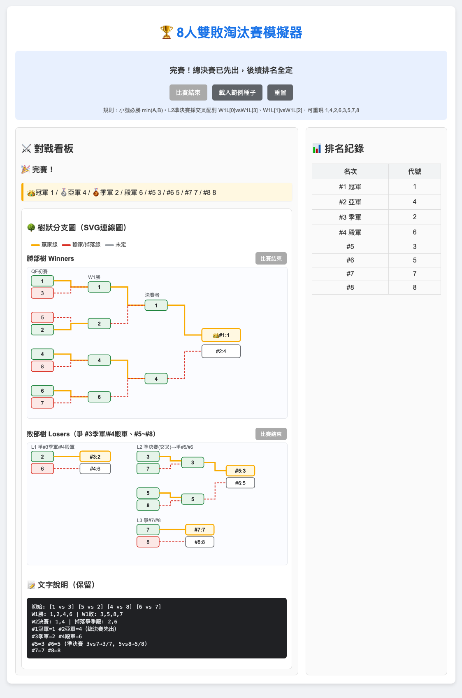

# 8人雙敗淘汰賽模擬器

8 名選手（代號 `1~8`）雙敗淘汰賽互動介面：**小號必勝 `min(A,B)`**，
總決賽先決定 `#1 冠軍 / #2 亞軍`，再依序決定敗部 `#3~#8` 名次。
提供 **HTML（瀏覽器）** 與 **Python Tkinter（桌面）** 兩種 GUI，邏輯完全一致。

> 截圖：載入範例種子 `[1,3] [5,2] [4,8] [6,7]` 並跑完全程，
> 排名為 `1, 4, 2, 6, 3, 5, 7, 8`（`#1冠軍 #2亞軍 #3季軍 #4殿軍`）。

## 規則

- 參賽 8 人，代號 `1~8`，開局隨機兩兩分組。
- 任何對戰：**代號數字小者獲勝**。
- 勝部：W1（4場）→ W2（2場）→ WF 總決賽（先出 `#1/#2`）。
- 敗部：L1 爭 `#3季軍/#4殿軍`（W2 掉落 2 人互打）
  → L2 爭 `#5/#6`（W1 敗者交叉準決賽 `W1L[0]vsW1L[3]、W1L[1]vsW1L[2]` 再決賽）
  → L3 爭 `#7/#8`（準決賽敗者互打）。
- 三顆執行按鍵同步：頂部主按鍵＋勝部樹內按鍵＋敗部樹內按鍵，同文案、同狀態、同動作。

## 執行方式

線上網頁直接玩：https://davioyao.github.io/Game_Proj/game.html

macOS / Windows 通用：雙擊 game.html 檔案。系統會自動使用預設的網頁瀏覽器（如 Google Chrome、Safari 或 Edge）將它開啟並執行。

操作：`開始隨機分組` / `載入範例種子` → 依序點擊執行按鍵
（頂部、勝部樹、敗部樹三處按鍵同步）→ 跑完 W1 → W2 → 總決賽 → L1 → L2 → L3。
